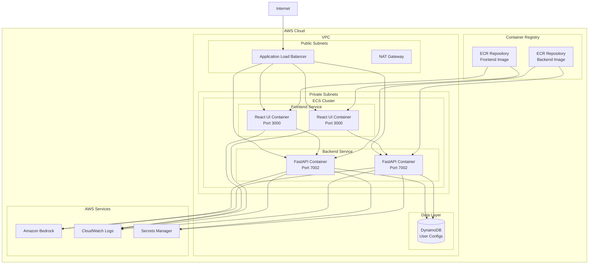

# AWS ECS Fargate 部署架构设计

## 应用概述

本应用包含两个主要组件：
- **React UI 前端**: Next.js 应用，提供聊天界面和服务器管理UI
- **FastAPI 后端**: Python 服务器，集成 AWS Bedrock 和 MCP 服务器管理

## 架构图



## 详细架构组件

### 1. 网络架构

#### VPC 配置
- **CIDR**: 10.0.0.0/16
- **可用区**: 2个AZ实现高可用

#### 子网配置
- **公有子网**: 
  - 10.0.1.0/24 (AZ-a)
  - 10.0.2.0/24 (AZ-b)
  - 部署 ALB 和 NAT Gateway

- **私有子网**:
  - 10.0.3.0/24 (AZ-a)
  - 10.0.4.0/24 (AZ-b)
  - 部署 ECS 容器

### 2. 负载均衡配置

#### Application Load Balancer (ALB)
```yaml
Target Groups:
  frontend-tg:
    port: 3000
    protocol: HTTP
    health_check_path: /
    
  backend-tg:
    port: 7002
    protocol: HTTP
    health_check_path: /api/health

Listeners:
  - port: 80
    protocol: HTTP
    redirect_to: HTTPS
    
  - port: 443
    protocol: HTTPS
    rules:
      - path: /v1/*
        target: backend-tg
      - path: /api/*
        target: backend-tg
      - path: /*
        target: frontend-tg
```

### 3. ECS 服务配置

#### 集群配置
```yaml
Cluster Name: mcp-app-cluster
Launch Type: FARGATE
Platform Version: LATEST
```

#### 前端服务配置
```yaml
Service Name: mcp-frontend-service
Task Definition: mcp-frontend-task
Desired Count: 2
Launch Type: FARGATE
Runtime Platform:
  CPU Architecture: ARM64
  Operating System: LINUX

Container Specification:
  Image: {ACCOUNT_ID}.dkr.ecr.{REGION}.amazonaws.com/mcp-frontend:latest
  CPU: 256
  Memory: 512
  Port: 3000
  
Environment Variables:
  - NODE_ENV: production
  - NEXT_PUBLIC_API_URL: https://your-domain.com
  
Health Check:
  Path: /
  Interval: 30s
  Timeout: 5s
  Healthy Threshold: 2
```

#### 后端服务配置
```yaml
Service Name: mcp-backend-service
Task Definition: mcp-backend-task
Desired Count: 2
Launch Type: FARGATE
Runtime Platform:
  CPU Architecture: ARM64
  Operating System: LINUX

Container Specification:
  Image: {ACCOUNT_ID}.dkr.ecr.{REGION}.amazonaws.com/mcp-backend:latest
  CPU: 512
  Memory: 1024
  Port: 7002
  
Environment Variables:
  - AWS_REGION: us-east-1
  - STRANDS_MODEL_PROVIDER: bedrock
  - MAX_TURNS: 200
  - INACTIVE_TIME: 1440
  
Secrets (from Secrets Manager):
  - API_KEY: arn:aws:secretsmanager:{REGION}:{ACCOUNT_ID}:secret:mcp-app/api-key
  
Health Check:
  Path: /api/health
  Interval: 30s
  Timeout: 5s
  Healthy Threshold: 2
```

### 4. IAM 角色和权限

#### ECS Task Execution Role
```json
{
  "Version": "2012-10-17",
  "Statement": [
    {
      "Effect": "Allow",
      "Action": [
        "ecr:GetAuthorizationToken",
        "ecr:BatchCheckLayerAvailability",
        "ecr:GetDownloadUrlForLayer",
        "ecr:BatchGetImage",
        "logs:CreateLogStream",
        "logs:PutLogEvents",
        "secretsmanager:GetSecretValue"
      ],
      "Resource": "*"
    }
  ]
}
```

#### ECS Task Role (Backend)
```json
{
  "Version": "2012-10-17",
  "Statement": [
    {
      "Effect": "Allow",
      "Action": [
        "bedrock:InvokeModel",
        "bedrock:InvokeModelWithResponseStream",
        "bedrock:ListFoundationModels"
      ],
      "Resource": "*"
    },
    {
      "Effect": "Allow",
      "Action": [
        "dynamodb:GetItem",
        "dynamodb:PutItem",
        "dynamodb:UpdateItem",
        "dynamodb:DeleteItem",
        "dynamodb:Query",
        "dynamodb:Scan"
      ],
      "Resource": "arn:aws:dynamodb:{REGION}:{ACCOUNT_ID}:table/mcp-user-configs"
    },
    {
      "Effect": "Allow",
      "Action": [
        "secretsmanager:GetSecretValue"
      ],
      "Resource": "arn:aws:secretsmanager:{REGION}:{ACCOUNT_ID}:secret:mcp-app/*"
    }
  ]
}
```

### 5. 安全组配置

#### ALB 安全组
```yaml
Ingress Rules:
  - Port: 80
    Protocol: TCP
    Source: 0.0.0.0/0
  - Port: 443
    Protocol: TCP
    Source: 0.0.0.0/0

Egress Rules:
  - All traffic to VPC CIDR
```

#### ECS 安全组
```yaml
Ingress Rules:
  - Port: 3000
    Protocol: TCP
    Source: ALB Security Group
  - Port: 7002
    Protocol: TCP
    Source: ALB Security Group

Egress Rules:
  - Port: 443
    Protocol: TCP
    Destination: 0.0.0.0/0
```

### 6. 数据存储

#### DynamoDB 表配置
```yaml
Table Name: mcp-user-configs
Partition Key: user_id (String)
Sort Key: server_id (String)
Billing Mode: On-Demand
Point-in-time Recovery: Enabled
```

#### CloudWatch Logs
```yaml
Log Groups:
  - /ecs/mcp-frontend
  - /ecs/mcp-backend
  
Retention Period: 7 days
```

## 容器镜像构建

### 前端 Dockerfile
```dockerfile
# 使用现有的 react_ui/Dockerfile
FROM node:22-alpine
WORKDIR /app
COPY package*.json ./
RUN npm install
COPY . .
ENV NODE_ENV=production
RUN npm run build
EXPOSE 3000
CMD ["npm", "run", "start", "--", "-H", "0.0.0.0"]
```

### 后端 Dockerfile
```dockerfile
FROM python:3.12-slim
WORKDIR /app

RUN apt-get update && apt-get install -y \
    build-essential \
    curl \
    && rm -rf /var/lib/apt/lists/*

COPY pyproject.toml ./
RUN pip install --no-cache-dir -e .

COPY src/ ./src/
COPY conf/ ./conf/
RUN mkdir -p certificates

ENV PYTHONPATH=/app
ENV PYTHONUNBUFFERED=1

EXPOSE 7002

HEALTHCHECK --interval=30s --timeout=30s --start-period=5s --retries=3 \
    CMD curl -f http://localhost:7002/api/health || exit 1

CMD ["python", "-m", "uvicorn", "src.main:app", "--host", "0.0.0.0", "--port", "7002"]
```

## 部署流程

### 1. 准备阶段
```bash
# 创建 ECR 仓库
aws ecr create-repository --repository-name mcp-frontend
aws ecr create-repository --repository-name mcp-backend

# 构建并推送镜像
docker build -t mcp-frontend ./react_ui
docker build -t mcp-backend -f Dockerfile.backend .

# 标记并推送到 ECR
docker tag mcp-frontend:latest {ACCOUNT_ID}.dkr.ecr.{REGION}.amazonaws.com/mcp-frontend:latest
docker tag mcp-backend:latest {ACCOUNT_ID}.dkr.ecr.{REGION}.amazonaws.com/mcp-backend:latest

docker push {ACCOUNT_ID}.dkr.ecr.{REGION}.amazonaws.com/mcp-frontend:latest
docker push {ACCOUNT_ID}.dkr.ecr.{REGION}.amazonaws.com/mcp-backend:latest
```

### 2. 基础设施部署
```bash
# 使用 CloudFormation 或 CDK 部署
# - VPC 和网络组件
# - ALB 和目标组
# - ECS 集群
# - IAM 角色
# - DynamoDB 表
# - Secrets Manager 密钥
```

### 3. 服务部署
```bash
# 注册任务定义
aws ecs register-task-definition --cli-input-json file://frontend-task-definition.json
aws ecs register-task-definition --cli-input-json file://backend-task-definition.json

# 创建服务
aws ecs create-service --cluster mcp-app-cluster --service-name mcp-frontend-service --task-definition mcp-frontend-task --desired-count 2
aws ecs create-service --cluster mcp-app-cluster --service-name mcp-backend-service --task-definition mcp-backend-task --desired-count 2
```

## 监控和日志

### CloudWatch 指标
- ECS 服务 CPU/内存使用率
- ALB 请求数量和延迟
- DynamoDB 读写容量单位

### CloudWatch 告警
- 高 CPU 使用率 (>80%)
- 高内存使用率 (>80%)
- 服务不健康任务数量
- ALB 5xx 错误率

### 日志聚合
- 应用日志通过 awslogs 驱动发送到 CloudWatch Logs
- 结构化日志便于搜索和分析

## 成本优化

### 资源调优
- 使用 Fargate Spot 实例降低计算成本
- 根据负载调整任务定义的 CPU/内存配置
- 配置自动伸缩策略

### 存储优化
- DynamoDB 使用按需计费模式
- CloudWatch Logs 设置合理的保留期限
- ECR 镜像设置生命周期策略

## 安全最佳实践

### 网络安全
- 所有计算资源部署在私有子网
- 使用 VPC 端点访问 AWS 服务
- 配置最小权限的安全组规则

### 访问控制
- 使用 IAM 角色而非访问密钥
- 敏感信息存储在 Secrets Manager
- 定期轮换访问密钥和密码

### 数据保护
- 启用传输加密 (HTTPS/TLS)
- 启用静态数据加密
- 定期备份关键数据

## 高可用性和灾难恢复

### 多可用区部署
- ALB 部署在多个可用区
- ECS 任务分布在多个可用区
- DynamoDB 自动跨可用区复制

### 自动恢复
- ECS 服务自动替换不健康的任务
- ALB 健康检查自动隔离故障实例
- Auto Scaling 根据负载自动调整容量

### 备份策略
- DynamoDB 启用时间点恢复
- ECR 镜像复制到备用区域
- 配置文件版本控制
