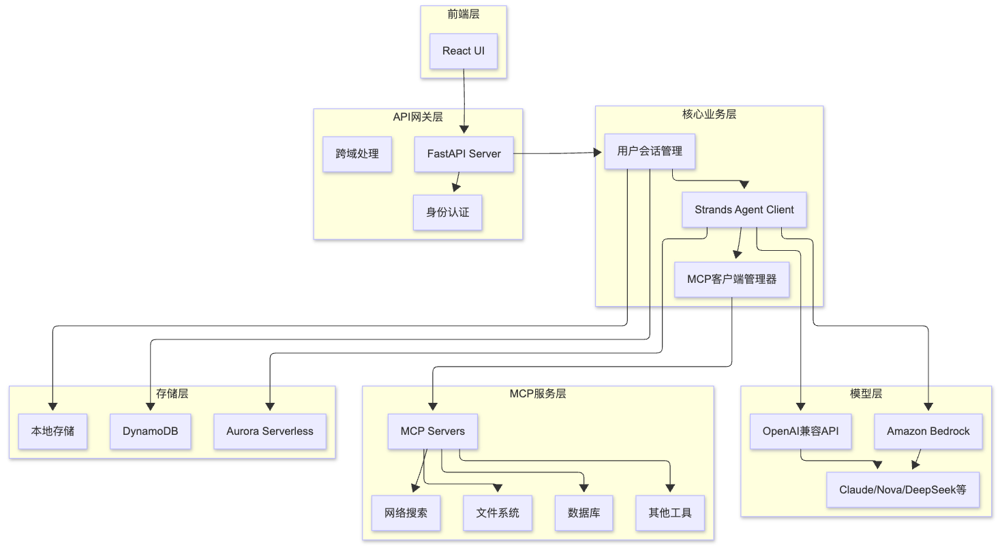
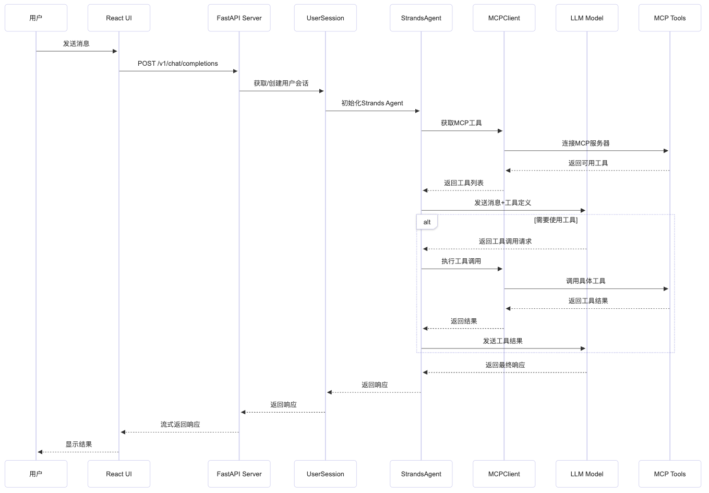
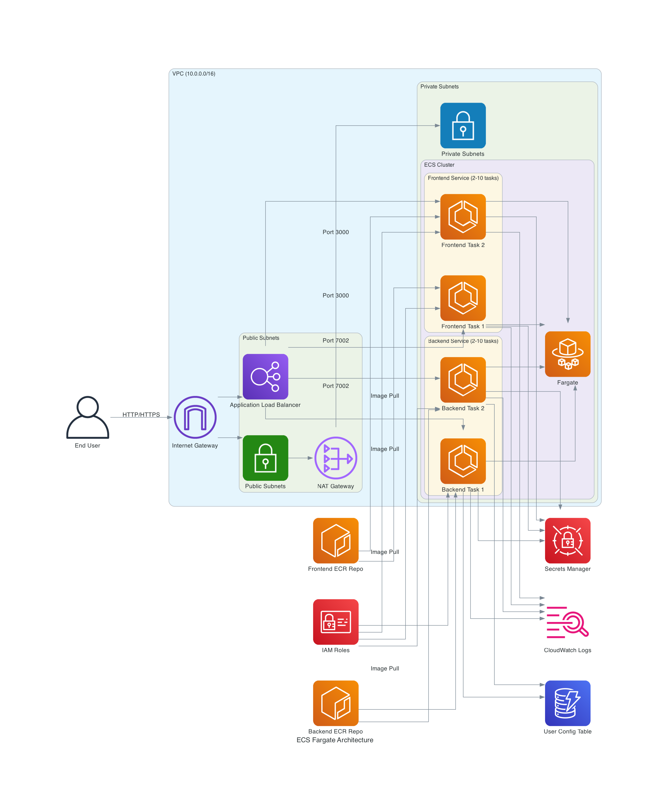

# Agentic AI with Strands Agents SDK [English](./README.en.md)

## 1.概述

这是基于Strands Agents SDK开发的通用型Agentic AI应用，通过MCP的集成，实现了大语言模型与外部工具系统的无缝连接。Strands SDK作为核心引擎，提供了强大的代理能力和工具集成机制，使得整个系统具备了高度的可扩展性和实用性。

### 1.1 功能特点
- **前后端分离** - MCP Client和MCP Server均可以部署到服务器端，用户可以直接使用web浏览器通过后端web服务交互，从而访问LLM和MCP Sever能力和资源
- **React UI** - 基于React的用户界面，允许用户与模型交互并管理MCP服务器，显示工具调用结果和思考过程
- **MCP 工具集成** - 提供STDIO, StreamableHTTP, SSE模式的MCP集成
- **多模型提供商** - 支持 Bedrock、OpenAI及兼容模型
- **多用户会话管理** - 维护多用户session

### 1.2 技术特色与优势
#### 架构优势
- 模块化设计 : 清晰的分层架构，各组件职责明确
- 可扩展性 : 支持多种模型提供商和MCP协议
- 高并发 : 异步处理和流式响应支持
- 资源管理 : 完善的会话和连接生命周期管理

#### MCP集成优势
- 标准兼容 : 完全兼容Anthropic MCP标准
- 多协议支持 : 支持Stdio、SSE、StreamableHTTP等多种传输协议
- 动态管理 : 支持运行时动态添加和移除MCP服务器
- 工具缓存 : 智能的工具获取和缓存机制

#### Strands SDK优势
- 统一接口 : 为不同模型提供商提供统一的代理接口
- 智能对话管理 : 内置滑动窗口对话管理器
- 工具集成 : 原生支持MCP工具集成
- 可观测性 : 集成Langfuse等可观测性工具

#### 应用场景
1. 企业知识助手 : 集成企业内部系统和知识库
2. DeepResearch  : 连接搜索，知识库等工具
3. 数据分析助手 : 连接数据库、BI工具进行智能数据分析
4. 办公自动化 : 集成日历、邮件、文档系统等办公工具
5. 客户服务 : 连接CRM、工单系统提供智能客服


### 1.3 系统架构图


### 1.4 系统流程图



## 2.安装方法（开发模式）
### 2.1. 依赖安装

目前主流 MCP Server 基于 NodeJS 或者 Python 开发实现并运行于用户 PC 上，因此用户 PC 需要安装这些依赖。

### 2.1 NodeJS

NodeJS [下载安装](https://nodejs.org/en)，本项目已对 `v22.12.0` 版本充分测试。

### 2.2 Python

有些 MCP Server 基于 Python 开发，因此用户必须安装 [Python](https://www.python.org/downloads/)。此外本项目代码也基于 Python 开发，需要安装环境和依赖。

首先，安装 Python 包管理工具 uv，具体可参考 [uv](https://docs.astral.sh/uv/getting-started/installation/) 官方指南

### 2.3 环境配置
下载克隆该项目后，进入项目目录创建 Python 虚拟环境并安装依赖：
```bash
uv sync
```

### 2.4 环境变量设置
把env.example 改成.env,根据情况修改以下变量：

- 如果在海外区使用Bedrock（默认）
```bash
CLIENT_TYPE=strands
STRANDS_MODEL_PROVIDER=bedrock
AWS_ACCESS_KEY_ID=your_access_key
AWS_SECRET_ACCESS_KEY=your_secret_key
AWS_REGION=us-east-1
```  
注意更改mem0所用的llm和embedding模型为bedrock模型   

```bash
LLM_MODEL=us.amazon.nova-pro-v1:0
EMBEDDING_MODEL=amazon.titan-embed-text-v2:0
```  

- 如果使用硅基流动等openai兼容接口模型,
```bash
AWS_REGION=cn-north-1
CLIENT_TYPE=strands
STRANDS_MODEL_PROVIDER=openai
OPENAI_API_KEY=your_openai_api_key
OPENAI_BASE_URL=https://api.siliconflow.cn/v1
```  

注意更改mem0所用的llm和embedding模型为国内模型  
```bash
LLM_MODEL=Qwen/Qwen3-14B
EMBEDDING_MODEL=Pro/BAAI/bge-m3
```

- 默认配置支持`DeepSeek-R1`,`Qwen3`等模型, 如果需要支持其他模型（必须是支持tool use的模型），请自行修改[conf/config.json](conf/config.json)配置加入模型，例如：

```json
  {
    "model_id": "Qwen/Qwen3-235B-A22B",
    "model_name": "Qwen3-235B-A22B"
  },
  {
    "model_id": "Qwen/Qwen3-30B-A3B",
    "model_name": "Qwen3-30B-A3B"
  },
  {
    "model_id": "Pro/deepseek-ai/DeepSeek-R1",
    "model_name": "DeepSeek-R1-Pro"
  },
  {
    "model_id": "deepseek-ai/DeepSeek-V3",
    "model_name": "DeepSeek-V3-free"
  }
```

### 2.4 启动后端服务

- 启动后端服务：
```bash
bash start_all.sh
```

### 2.5 前端
**前提条件**
- 安装Docker和Docker Compose：https://docs.docker.com/get-docker/
- Linux下安装Docker命令：
```bash
# 安装Docker
curl -fsSL https://get.docker.com -o get-docker.sh
sudo sh get-docker.sh

# 安装Docker Compose
sudo curl -L "https://github.com/docker/compose/releases/download/v2.24.6/docker-compose-$(uname -s)-$(uname -m)" -o /usr/local/bin/docker-compose
sudo chmod +x /usr/local/bin/docker-compose
ln -s /usr/bin/docker-compose  /usr/local/bin/docker-compose
```
1. 克隆仓库之后
```bash
cd demo_mcp_on_amazon_bedrock/react_ui
```

2. 创建环境变量文件
```bash
cp .env.example .env.local
```

3. 使用Docker Compose构建并启动服务
```bash
docker-compose up -d --build
```

#### 其他Docker常用命令
```bash
# 查看容器日志
docker logs -f mcp-bedrock-ui

# 重启容器
docker-compose restart

# 停止容器
docker-compose down

# 重新构建并启动（代码更新后）
docker-compose up -d --build
```

## 3.安装方法（生产模式，AWS ECS部署）
请参考 [CDK部署说明](cdk/README-CDK.md)

 这个Demo的部署架构遵循AWS最佳实践，将应用程序部署在私有子网中，通过负载均衡器提供公共访问，并使用Fargate实现无服务器容器管理。 这个部署架构包含以下主要亚马逊云组件：
1. ECS Cluster：
 • 运行在Fargate上的无服务器容器环境, 使用ARM架构
 • 前端服务：最小2个任务，根据CPU使用率自动扩展
 • 后端服务：最小2个任务，根据CPU使用率自动扩展

2.  VPC ：
 • 包含公有子网和私有子网，跨越2个可用区
 • 公有子网中有Internet Gateway和NAT Gateway
 • 私有子网用于运行ECS任务

3. 应用负载均衡：
 • 应用负载均衡器(ALB)分发流量
 • 将/v1/*和/api/*路径的请求路由到后端服务
 • 将其他请求路由到前端服务

4. 数据存储：
 • DynamoDB表用于存储用户配置

5. 安全组件：
 • IAM角色和策略控制访问权限
 • Secrets Manager生成并存储后端服务API KEY配置信息
 • 安全组控制网络流量

6. 容器镜像：
 • 前端和后端容器镜像存储在ECR中


## 4.更多示例
- [case](./README_cases.md)