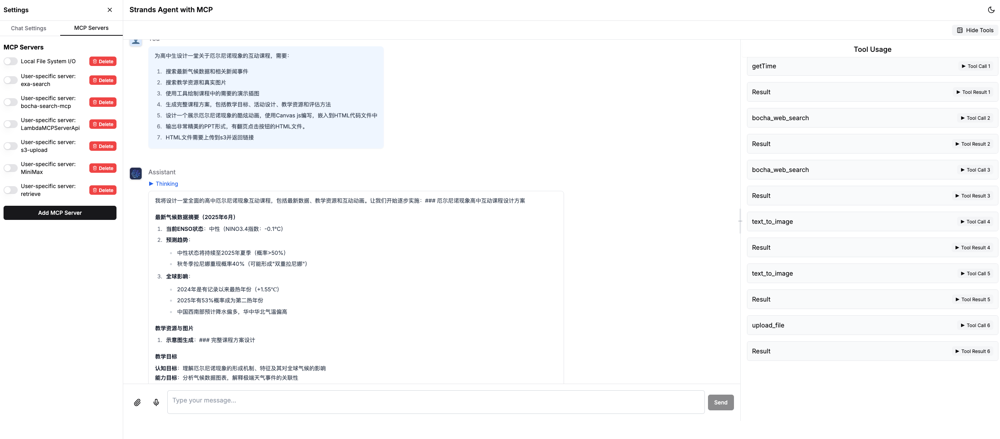
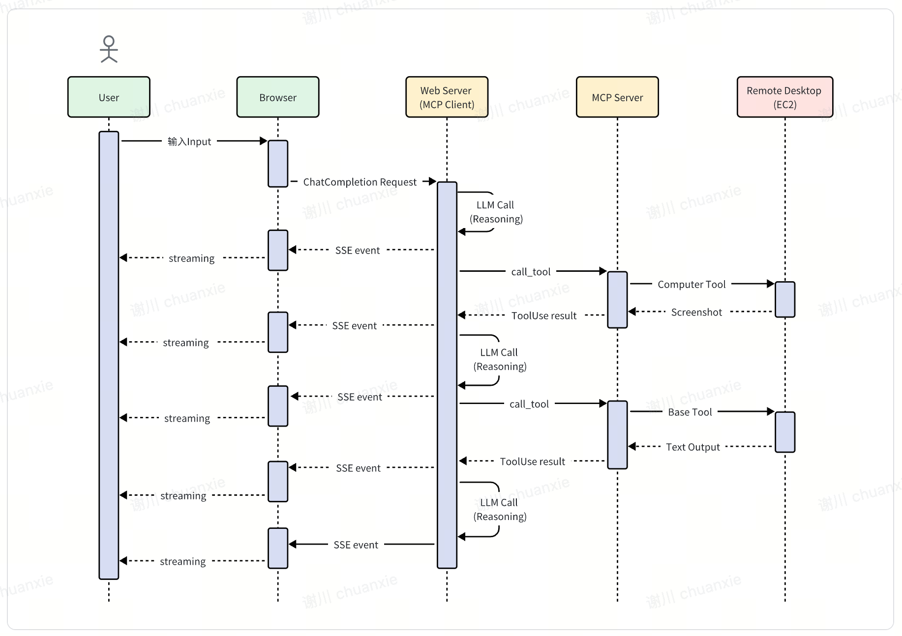

## 使用介绍

### React Web UI 
- 🚀 基于Next.js 15和React 18构建的现代化前端，支持Dark/Light模式
- 🎨 使用Tailwind CSS和Shadcn UI组件库实现美观的用户界面
- 🔄 实时流式响应，提供流畅的对话体验
- 🧠 支持"思考"模式，展示模型的推理过程
- 🛠️ MCP服务器管理功能，支持添加和配置服务器
- 👤 用户会话管理，保持对话上下文
- 📊 可视化工具使用结果，包括图像显示


### 添加 MCP Server
当前可以通过两种方式来添加 MCP Server：
1. 预置在 `conf/config.json`，每次重新启动 Chat 接口服务就会加载配置好的 MCP Server 
2. 通过 ChatBot UI 来添加 MCP Server，表单提交 MCP Server 参数即可，仅当前生效、服务重启后失效  
下面演示如何通过 ChatBot UI 添加 MCP Server，这里以 Web Search 供应商 [Exa](https://exa.ai/) 为例，开源社区已有针对它的 [MCP Server](https://github.com/exa-labs/exa-mcp-server) 可用。  
首先，前往 [Exa](https://exa.ai/) 官网注册账号，并获取 API Key。  
然后点击【添加 MCP Server】，在弹出菜单中填写如下参数并提交即可：  
- 方式1，直接添加MCP json 配置文件(与Anthropic官方格式相同)   
```json
{
  "mcpServers": {
    "exa": {
      "command": "npx",
      "args": ["-y","exa-mcp-server"],
      "env": {
        "EXA_API_KEY": "your-api-key-here"
      }
    }
  }
}
```
- 方式2，按字段添加 

此时在已有 MCP Server 列表中就可以看到新添加项，勾选即可启动该 MCP Server。

## 使用示例说明
### 1.使用MCP Computer Use 操作 EC2 remote desktop
- 如果是生产模式，已经在集群中提前下载了代码

- 如果是开发模式下，需要安装下载remote-computer-use  
```bash
git clone https://github.com/aws-samples/aws-mcp-servers-samples.git
```  
注意下面配置的--directory 路径要改成本地的路径  


- 需要提前安装一台EC2实例，并配置VNC远程桌面。安装步骤请参考[说明](https://github.com/aws-samples/aws-mcp-servers-samples/blob/main/remote_computer_use/README.md)
- 环境配置好之后，在MCP demo客户端配置如下：
```json
{
    "mcpServers": {
        "computer_use": {
            "command": "uv",
            "env": {
                "VNC_HOST":"",
                "VNC_PORT":"5901",
                "VNC_USERNAME":"ubuntu",
                "VNC_PASSWORD":"",
                "PEM_FILE":"",
                "SSH_PORT":"22",
                "DISPLAY_NUM":"1"
            },
            "args": [
                "--directory",
                "/app/aws-mcp-servers-samples/remote_computer_use",
                "run",
                "server_claude.py"
            ]
        }
    }
}
```
- 使用Computer Use推荐用Claude 3.7模型，并添加如下system prompt  

```plaintext
You are an expert research assistant with deep analytical skills.
you have capability:
<SYSTEM_CAPABILITY>
* You are utilising an Ubuntu virtual machine using Linux architecture with internet access.
* You can feel free to install Ubuntu applications with your bash tool. Use curl instead of wget.
* When viewing a page it can be helpful to zoom out so that you can see everything on the page.  Either that, or make sure you scroll down to see everything before deciding something isn't available.
* When using your computer function calls, they take a while to run and send back to you.  Where possible/feasible, try to chain multiple of these calls all into one function calls request.
* You can double click to open firefox
</SYSTEM_CAPABILITY>
<IMPORTANT>
  * Don't assume an application's coordinates are on the screen unless you saw the screenshot. To open an application, please take screenshot first and then find out the coordinates of the application icon. 
  * When using Firefox, if a startup wizard or Firefox Privacy Notice appears, IGNORE IT.  Do not even click "skip this step".  Instead, click on the address bar where it says "Search or enter address", and enter the appropriate search term or URL there. Maximize the Firefox browser window to get wider vision.
  * If the item you are looking at is a pdf, if after taking a single screenshot of the pdf it seems that you want to read the entire document instead of trying to continue to read the pdf from your screenshots + navigation, determine the URL, use curl to download the pdf, install and use pdftotext to convert it to a text file, and then read that text file directly with your StrReplaceEditTool.
  * After each step, take a screenshot and carefully evaluate if you have achieved the right outcome. Explicitly show your thinking: "I have evaluated step X..." If not correct, try again. Only when you confirm a step was executed correctly should you move on to the next one.
</IMPORTANT>
```   

- **时序图:使用Computer Use 操作 EC2 Remote Desktop**  



## Awsome MCPs
- AWS MCP Servers Samples https://github.com/aws-samples/aws-mcp-servers-samples
- AWS Labs MCP Servers https://awslabs.github.io/mcp
- https://github.com/punkpeye/awesome-mcp-servers
- https://github.com/modelcontextprotocol/servers
- https://www.aimcp.info/en
- https://github.com/cline/mcp-marketplace
- https://github.com/xiehust/sample-mcp-servers
- https://mcp.composio.dev/
- https://smithery.ai/
- https://mcp.so/


**[LICENSE](./LICENSE)**s