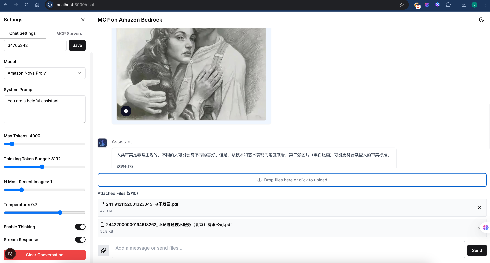
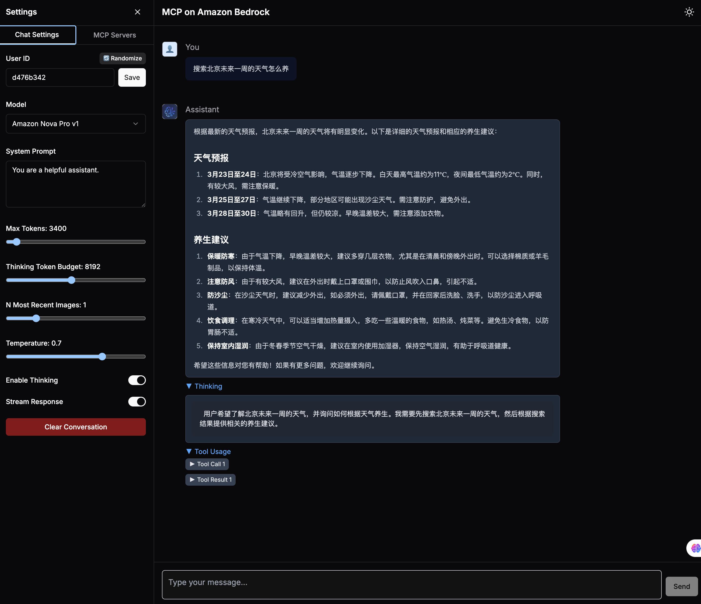

# MCP on Amazon Bedrock - Next.js UI

这是一个使用Next.js框架构建的React前端应用，用于与Amazon Bedrock上的MCP服务进行交互。该应用提供了一个现代化、响应式的用户界面，支持与各种大语言模型进行对话，并可以配置和管理MCP服务器。

## 功能特点
- 🚀 基于Next.js 14和React 18构建的现代化前端，支持Dark/Light模式
- 🎨 使用Tailwind CSS和Shadcn UI组件库实现美观的用户界面
- 🔄 实时流式响应，提供流畅的对话体验
- 🧠 支持"思考"模式，展示模型的推理过程
- 🛠️ MCP服务器管理功能，支持添加和配置服务器
- 👤 用户会话管理，保持对话上下文
- 📊 可视化工具使用结果，包括图像显示
- 📱 响应式设计，适配各种设备尺寸



## 技术栈

- **前端框架**: Next.js 15 (App Router)
- **UI库**: React 18, Tailwind CSS, Shadcn UI
- **状态管理**: React Context API + Zustand
- **API通信**: Fetch API, Server Actions
- **实时通信**: Server-Sent Events (SSE)

## 快速开始

### 使用Docker部署（推荐）

#### 前提条件
- 安装Docker和Docker Compose：https://docs.docker.com/get-docker/
- Linux下安装Docker命令：
```bash
# 安装Docker
curl -fsSL https://get.docker.com -o get-docker.sh
sudo sh get-docker.sh

# 安装Docker Compose
sudo curl -L "https://github.com/docker/compose/releases/download/v2.24.6/docker-compose-$(uname -s)-$(uname -m)" -o /usr/local/bin/docker-compose
sudo chmod +x /usr/local/bin/docker-compose
ln -s /usr/bin/docker-compose  /usr/local/bin/docker-compose
```
1. 克隆仓库之后
```bash
cd sample_agentic_ai_strands/react_ui
```

2. 创建环境变量文件
```bash
cp .env.example .env.local
```


#### Option 1: HTTP模式
1. 编辑`.env.local`文件，添加必要的环境变量（Docker会自动从该文件加载环境变量）
```
# API Key for authentication
NEXT_PUBLIC_API_KEY=123456

# Base URL for MCP service - Server side (internal)
# 由于使用host网络模式，可以直接使用localhost访问宿主机服务
SERVER_MCP_BASE_URL=http://localhost:7002

# Base URL for MCP service - Client side (必须使用Next.js API路由避免CORS问题)
NEXT_PUBLIC_MCP_BASE_URL=/api
```

> **注意**：我们使用Docker的host网络模式（network_mode: "host"），使容器直接共享宿主机的网络栈。
> 这样容器可以直接使用localhost访问宿主机上运行的服务，简化了配置。
> 使用host网络模式时，容器的端口会直接映射到宿主机上，无需额外的端口映射。

2. 使用Docker Compose构建并启动服务
```bash
docker-compose up -d
```

3. 如果是本地部署，则在浏览器中访问 [http://localhost:3000/chat](http://localhost:3000/chat) 如果在ec2部署，则访问ec2 ip


#### 其他Docker常用命令
```bash
# 查看容器日志
docker logs -f mcp-bedrock-ui

# 重启容器
docker-compose restart

# 停止容器
docker-compose down

# 重新构建并启动（代码更新后）
docker-compose up -d --build
```


### 使用Node.js直接部署（开发模式）

#### 前提条件

- Node.js 22.x 或更高版本, 安装参考：https://nodejs.org/en/download   
- Linux下安装命令
```bash
# Download and install nvm:
curl -o- https://raw.githubusercontent.com/nvm-sh/nvm/v0.40.2/install.sh | bash

# in lieu of restarting the shell
\. "$HOME/.nvm/nvm.sh"

# Download and install Node.js:
nvm install 22

# Verify the Node.js version:
node -v # Should print "v22.14.0".
nvm current # Should print "v22.14.0".

# Verify npm version:
npm -v # Should print "10.9.2".
```

### 安装步骤

1. 克隆仓库之后
```bash
cd demo_mcp_on_amazon_bedrock/react_ui
```

2. 安装依赖
```bash
npm install
```
- 安装pm2工具
```bash
npm -g install pm2
```

3. 创建环境变量文件
```bash
cp .env.example .env.local
```

4. 编辑`.env.local`文件，添加必要的环境变量, `API_KEY`跟后端MCP后台服务，在项目根目录中.env定义的一致就可以
```
NEXT_PUBLIC_API_KEY=123456
SERVER_MCP_BASE_URL=http://localhost:7002
NEXT_PUBLIC_MCP_BASE_URL=/api
```

5. 启动开发模式
```bash
npm run dev
```

6. 在浏览器中访问 [http://localhost:3000/chat](http://localhost:3000/chat)

## 项目结构

```
/
├── app/                  # Next.js App Router
│   ├── api/              # API路由
│   ├── chat/             # 聊天页面
│   └── page.tsx          # 首页
├── components/           # React组件
│   ├── chat/             # 聊天相关组件
│   ├── mcp/              # MCP服务器相关组件
│   ├── ui/               # UI组件库
│   └── providers/        # 上下文提供者
├── lib/                  # 工具函数和服务
│   ├── api/              # API客户端
│   ├── hooks/            # 自定义Hooks
│   ├── store/            # 状态管理
│   └── utils/            # 工具函数
├── pages/                # Pages Router (API路由)
│   └── api/              # API端点
├── public/               # 静态资源
├── styles/               # 全局样式
├── .dockerignore         # Docker忽略文件
├── docker-compose.yml    # Docker Compose配置
├── Dockerfile            # Docker构建文件
└── pm2run.config.js      # PM2配置文件
```

## Docker部署架构

使用Docker部署时，应用程序运行在容器化环境中，具有以下优势：

- 🔄 一致的运行环境，避免"在我的机器上能运行"的问题
- 🚀 简化的部署流程，只需一个命令即可启动
- 🛡️ 隔离的应用环境，提高安全性
- 📦 便于分发和版本控制
- 🔌 与其他Docker容器化服务（如数据库、缓存等）轻松集成

### 网络架构

```
┌─────────────────────────────────────────────────────────────────┐
│                                                                 │
│  Docker Host                                                    │
│  ┌─────────────────────────┐                                    │
│  │                         │                                    │
│  │  mcp-bedrock-ui         │                                    │
│  │  (Next.js Application)  │◄───┐                               │
│  │  Port: 3000             │    │                               │
│  │                         │    │                               │
│  └───────────┬─────────────┘    │                               │
│              │                  │                               │
│              │                  │                               │
│              ▼                  │                               │
│  ┌───────────────────────┐      │      ┌─────────────────────┐  │
│  │                       │      └──────┤                     │  │
│  │  Next.js API Routes   │             │  Browser            │  │
│  │  (/api/*)             │◄────────────┤                     │  │
│  │                       │             │                     │  │
│  └───────────┬───────────┘             └─────────────────────┘  │
│              │                                                  │
│              │                                                  │
│              ▼                                                  │
│  ┌───────────────────────┐                                      │
│  │                       │                                      │
│  │  MCP Backend Service  │                                      │
│  │  Port: 7002           │                                      │
│  │                       │                                      │
│  └───────────────────────┘                                      │
│                                                                 │
└─────────────────────────────────────────────────────────────────┘
```